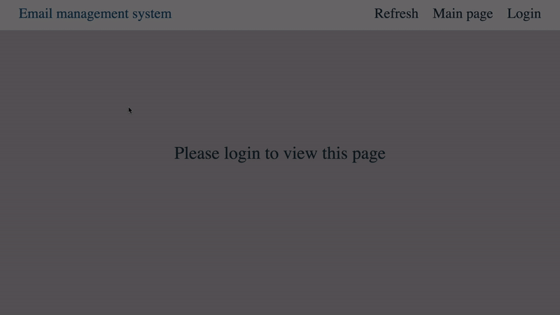

# Requests Management System

## About

A tool for managing requests got from html. The request consists of name, surname, email 
and optional question. The admin is able either to monitor sent requests and reply manually or set up an auto response 
in case of question absence (email). The app consists of an API (FastAPI) and admin panel (React). Everything is stored on a Postgres database.

## Getting started

Clone the repo to your machine. Make sure [Docker](https://www.docker.com) is installed on the machine.

### Set-up

Some data needs to be provided to start the tool:

- An email account and its password (app password for gmail) to send messages back
- SMTP server of your email provider (f.e. `smtp.gmail.com` for gmail)
- Postgres database user and its password (to access db directly if needed)
- Default reply message

A tool uses `.env` files to keep this information. You can either manually or automatically create them.
For the first option you could
execute `docker run -it --rm --name ps1 -v $(pwd)/.:/project -w /project python:3.10-alpine
python setup/setup.py` within a project root directory, a Python script will be run. Or as a variant, you could create `.env` files in `rootdir/server`
and `rootdir/database` directories using `.env.template` files in corresponding directories.
For the default message, you customize a file `rootdir/server/src/message/default_message.txt` for your needs.
{phn} and {phs} are placeholders for name and surname of the request owner, do not delete them.

### Docker

To start the containers stack, be sure to be on the `docker-compose.yml` file level (root directory), then execute
`docker-compose up --build` to start all the containers. After the process is done, the port 80 will be exposed to your
machine, where frontend is located.

### Register admin

To maintain submitted requests, an admin must be registered within a postgres database.
Make sure the container stack is up. Type in the terminal `docker compose exec -it wsgi /bin/bash` from the project root
directory to enter a WSGI docker container (FastApi). Type `python3 -m src.init_admin`. After supplying your
data, you would be able to log in into the admin panel through http://localhost:80 with your email and password.

### How to use

The idea is to start the container stack on the machine which could be used as a server. You can include 'request 
form' to any of your web-sites, so visitors would be able to interact with it. The sample form which talks to an API is
stored into `rootdir/setup/sample_client_form.html` .

## Details

A database is stored inside the docker environment on the volume called `pg_data_1`

# Preview 

Using a sample form, we send some fake requests to the server. Within our sample email account, we would be able to see 
auto-response message and then an answer.

## GIF

# Youtube

